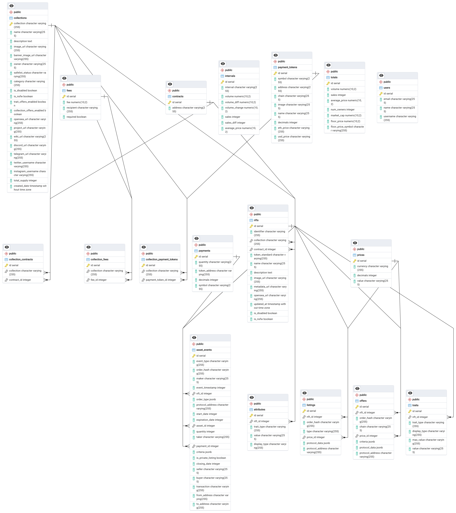

# VPLAY MVP

## This is the repo for the current VPLAY website and mvp

## Keep keys in .env.local and DO NOT upload

### By default the middleware will prevent access to the mvp, please make a branch from main and modify the middleware paths to work on the mvp before making a pull request and changing back the middleware

```
npm i
npm run dev
```


## How to contribute/navigate

## Styling

### Use shadcn components wherever possible and inline tailwind everywhere else, no raw css/scss please

## Directories and important files

### package.json

- see commands/scripts and dependencies here

#### app

- pages of the website, to make a page create a directory with the page name and a page.tsx file
- home/index page is in the page.tsx at the root of the app directory
- globals.css is to set up tailwind, please use shadcn components and inline tailwind instead of css
- api folder is for our public api, make a directory and a route.ts to configure a new public api route -> NOTE: need to move the airtable and opensea routes to server

#### components

- universal components live in root of components directory
- components unique to a page live in its own directory named [directoryName]Components

#### lib

- don't touch this is to set up shadcn

#### public

- keep media assets here

#### store

- zustand directory for state management
- when a user navigates to a new page, load the state into zustand so the child components may use it or throught the application
- might need to call a custom hook in the hooks directory if you need to call the api

#### hooks

- custom hooks to fetch data from our api and external api

#### utils

- keep types and miscelaneous utility files and functions here

#### middleware.ts

- modify to limit access to certain pages and routes

### db

- drizzle orm and postgres database files and tables based on types

### types

- add more files here as necessary

### schema 


